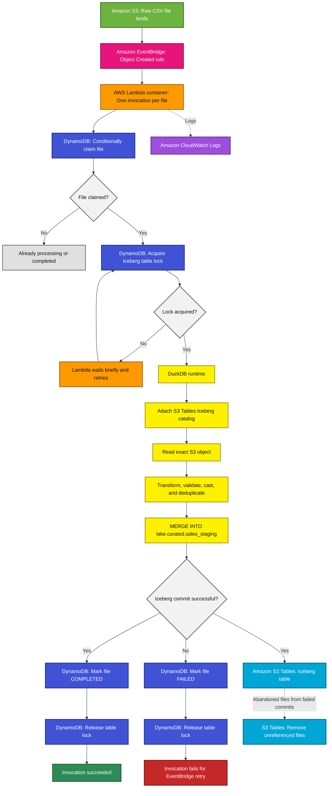
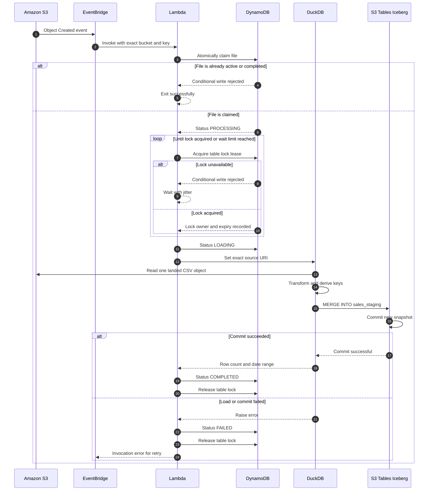

# Near-real-time S3 to S3 Tables Iceberg ingestion

This package replaces the short-lived Fargate task with a Lambda container
running DuckDB.

The Lambda:

1. Receives an S3 `Object Created` event through EventBridge.
2. Atomically claims the exact object in DynamoDB.
3. Acquires a short lease for `lake.curated.sales_staging`.
4. Reads the exact landed CSV object.
5. Runs the existing DuckDB transformation and Iceberg `MERGE`.
6. Marks the file `COMPLETED` or `FAILED`.
7. Releases the table lock in a `finally` block.

The existing staging SQL is included without changing its transformation or
natural-key merge logic.

## Architecture

Paste only the contents inside this Mermaid block into a Mermaid-only editor.



## Processing sequence



## DynamoDB records

The same table stores file records and the current table lock.

```text
FILE#bucket#key#version-or-etag
LOCK#lake.curated.sales_staging
```

A completed file cannot be reclaimed. A failed file can be reclaimed by an
EventBridge retry. A stale `PROCESSING` or `LOADING` item can also be reclaimed
after its lease expires.

The table lock is a lease rather than a permanent lock. If an invocation dies,
another invocation can acquire it after `expires_at`.

## Package contents

```text
.
├── README.md
├── template.yaml
├── samconfig.toml.example
├── scripts
│   ├── enable_s3_eventbridge.sh
│   └── test_event.json
└── src
    ├── Dockerfile
    ├── app.py
    ├── ledger.py
    ├── loader.py
    ├── requirements.txt
    ├── table_lock.py
    └── sql
        ├── 01_attach_lambda.sql
        └── 03_load_staging.sql
```

## Important assumptions

### Input format

Your current `03_load_staging.sql` reads:

```sql
read_csv(getvariable('slice'), union_by_name = true)
```

Therefore, the event prefix in this starter must contain CSV objects. If
your actual landed incremental files are CSV, change the source read in
`03_load_staging.sql` and deploy with:

```text
ExpectedSuffix=.csv
```

### Lambda duration

Set the Lambda timeout to 15 minutes. The lock lease defaults to 14 minutes.
The lock wait limit defaults to four minutes, leaving the remaining invocation
time for DuckDB.

If a single file begins approaching Lambda's memory, `/tmp`, or runtime limits,
move the same modules back into a short-lived Fargate task without changing the
DynamoDB record design.

## Deploy

### 1. Configure SAM

```bash
cp samconfig.toml.example samconfig.toml
```

Review:

- raw bucket and prefix;
- S3 Tables table-bucket ARN;
- Lambda memory and timeout;
- target namespace and table.

### 2. Build

Docker must be running:

```bash
sam build --use-container
```

The image build installs the DuckDB `aws`, `httpfs`, and `iceberg` extensions
into the container.

### 3. Deploy

```bash
sam deploy --guided
```

For later deployments:

```bash
sam build --cached --parallel
sam deploy
```

### 4. Upload a test object

Upload a real CSV object under the configured prefix. Then inspect:

```bash
aws logs tail \
  /aws/lambda/goliath-iceberg-ingestion-IngestionFunction \
  --follow \
  --region us-east-1
```

The exact generated Lambda log-group name may include the stack identifier.
It can also be opened from the CloudFormation stack outputs/resources.

## Local invocation

Build first:

```bash
sam build --use-container
```

Update `scripts/test_event.json` to point at a real object and ETag, then run:

```bash
sam local invoke IngestionFunction \
  --event scripts/test_event.json \
  --env-vars local-env.json
```

Example `local-env.json`:

```json
{
  "IngestionFunction": {
    "AWS_PROFILE": "dcr",
    "AWS_REGION": "us-east-1",
    "LEDGER_TABLE": "goliath-iceberg-ingestion",
    "TABLE_BUCKET_ARN": "arn:aws:s3tables:us-east-1:747273370721:bucket/goliath-curated",
    "TABLE_LOCK_ID": "LOCK#lake.curated.sales_staging",
    "EXPECTED_SUFFIX": ".CSV",
    "CATALOG_ALIAS": "lake",
    "ICEBERG_NAMESPACE": "curated",
    "TARGET_TABLE": "sales_staging"
  }
}
```

For SAM local, mount or expose the local AWS profile to the container as needed.
The deployed Lambda uses its execution role and does not use a named profile.

## Operational behavior

### Duplicate event

The file claim fails conditionally and the invocation exits successfully.

### Import failure

The ledger item becomes `FAILED`, the lock is released, and the handler raises.
An EventBridge retry can claim the `FAILED` item and try again.

### Lambda terminates unexpectedly

The file and lock leases eventually expire. A repeated S3 event or manually
replayed EventBridge event can reclaim the file.

### Successful import

The item becomes `COMPLETED`. Future duplicate events are ignored.

## Notes on the existing MERGE

The included SQL currently contains:

```sql
WHEN NOT MATCHED THEN INSERT *;
```

It is insert-only for an existing natural key. Reprocessing is safe, but a
corrected source row with the same key will not update the existing row. Add a
`WHEN MATCHED THEN UPDATE` clause later if corrected exports must overwrite
existing values.
